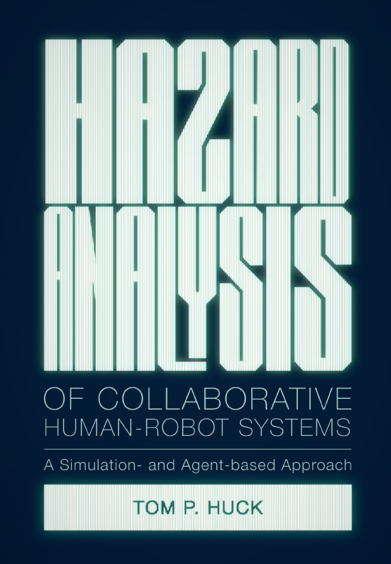
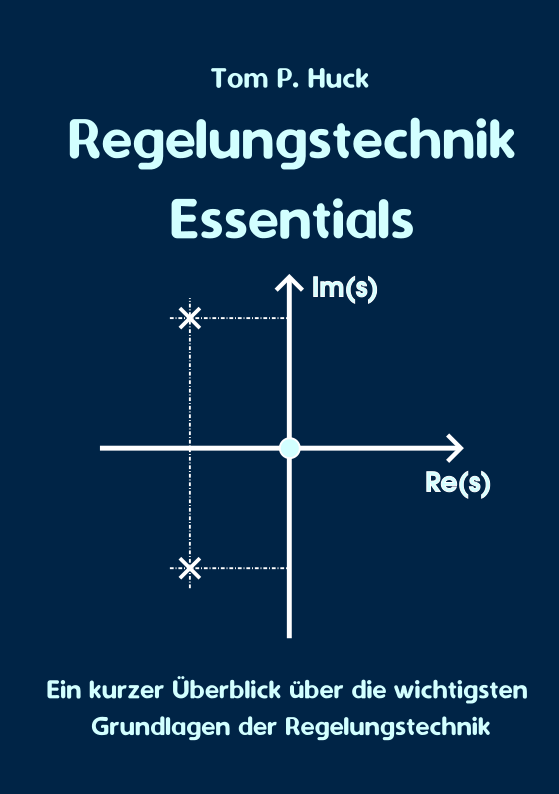

<h1>
  

    Welcome to my personal page!
  

</h1>

  

### About me
I am an electrical engineer who studied at Karlsruhe Institute of Technology (KIT) in Germany. On this personal page I talk about my work, my publications, and some
of my other interests. If you want to reach out, please contact me via
[E-Mail](mailto:hucktm@gmail.com). 
My main interests are: 
- Embedded systems ,
- Functional Safety, and
- Control Theory.  

These topics go hand in hand: Embedded systems are computer systems which interact with the physical word (such as in cars or robots). As such systems are often safety-critical, we need functional safety to ensure that they do not pose a risk to us humans. Finally, control theory provides the theoretical mathematical foundation which tells us how to control physical systems so that behave as intended.

### Embedded Systems
My first practical experience with embedded systems was when I worked as an intern and later part-time employee at an automotive supplier during my master studies. At the time, I was involved in several projects related to embedded systems in electric vehicles. This included real-time temperature estimation, condition monitoring, and adaptive control of electric drive systems. For more info, see our related patents: 
- [Real-time temperature estimation](https://patents.google.com/patent/US11971314B2/enC)
- [Condition monitoring](https://patents.google.com/patent/US11575340B2/en)
- [Adaptive Control](https://register.dpma.de/DPMAregister/pat/register?AKZ=1020181038313)

The combination of the digital "software world" and the physical "real world", interacting through sensors and actuators, fascinated me and sparked a more general interest in embedded systems. Since then I have been involved in various activities related to embedded and cyber-physical systems, including:
- Robotics research (see also next section below)
- Holding lectures on [real-time systems](https://ipr.iar.kit.edu/lehrangebote_3805.php) at KIT (from 2019-2023)
- Software- and system-development in industrial embedded projects (since 2023)

### Functional Safety
I first came into contact with the topic of functional safety when I worked as a 
robotics researcher at KIT. At that time, my main research field was safety in 
human-robot collaboration (HRC). More and more robot systems are built to collaborate 
directly with humans. Obviously, safety is a major concern for these systems. 
Thus, before becoming operational, HRC systems must be analyzed thoroughly to assess if these
systems are actually safe. Such an analysis is called
[hazard analysis](https://en.wikipedia.org/wiki/Hazard_analysis). 
In my research, investigated how simulation-based testing can be used as a tool to effectively
support hazard analysis of collaborative human-robot systems and assess the functional safety 
of these systems. The following book summarizes my research:

  

Additional publications can be found on my [Google Scholar Profile](https://scholar.google.com/citations?user=gdPyPDwAAAAJ&hl=en&oi=ao).

### Control Theory
My third area of interest is control theory. This is also closely related to my interest of embedded systems,
since control theory is an integral part of understading and controlling physical processes in the real world. What I find especially
fascinating about control theory is that it provides a kind of 'abstraction layer' which translates physical behaviors from various domains (electrical, mechanical, thermal,...) to a unified mathematical description (differential equations, laplace transfer functions etc.). This allows you to disassociate from technical implementations to a certain extent and think about the abstract behavior of a system in more general terms. 

Since 2022, I hold a lecture on control theory at [Duale Hochschule Baden Württemberg](https://www.karlsruhe.dhbw.de/en/general/about-dhbw-karlsruhe.html) (DHBW) in Karlsruhe.
You can find an overview of my lecture materials by clicking on the image below.

  

The goal of my lecture is to provide a basic introduction to control theory for computer scientists. Therefore, the slides are somewhat
simplified compared to a full-fledged control theory course. However, I believe they are excellent for getting a first grasp
and undestand the essentials. Unfortunately, the slides are currently available in German language only. For an English introduction that featurs a bit more detail, I recommend this [Book by Steven A. Frank ](https://link.springer.com/book/10.1007/978-3-319-91707-8) which is available on the Springer website free of charge.

