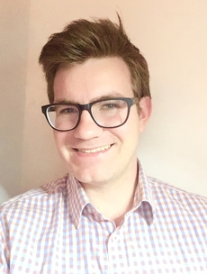
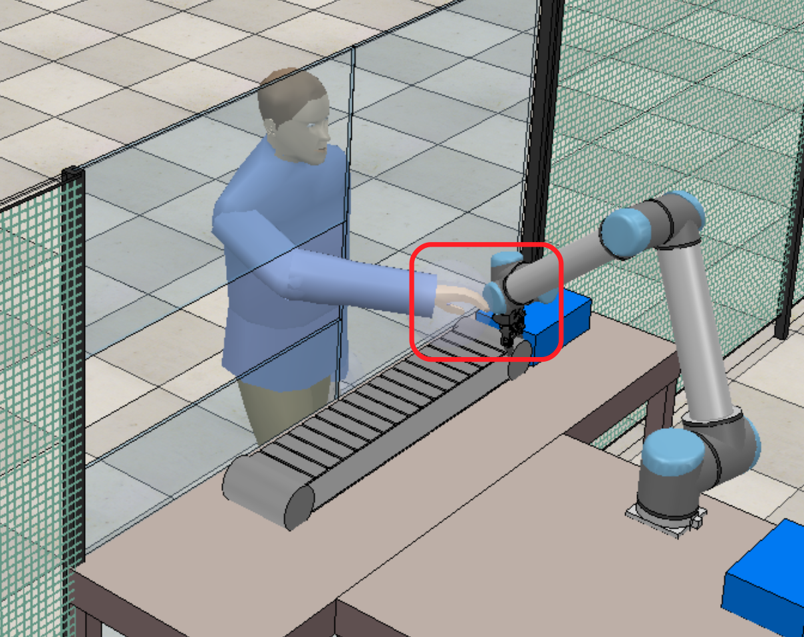
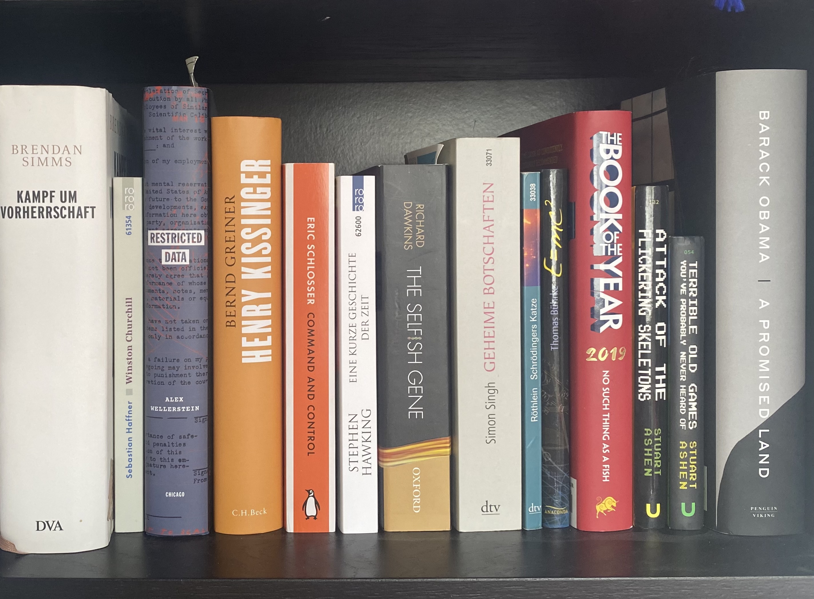

<h1>
  

    Welcome to my personal page!
  

</h1>

  

### About me
I am currently a scientific assistant and PhD student at Karlsruhe Institute of
Technology (KIT) in Germany. Before that, I studied mechatronics and electrical
engineering at KIT. During my studies, I have also worked as an intern and
student trainee on different projects in the field of E-Mobility. 
On this personal page I talk about my work, my publications, and some
of my non-work related interests. If you want to reach out, please contact me via
[E-Mail](mailto:tom.p.huck@gmail.com).

### Work

#### Robotics
My main research interest is safety in human-robot collaboration (HRC). More and
more robot systems are built to collaborate directly with humans. Obviously,
safety is a major concern for these systems. Thus, before becoming operational,
HRC systems must be analyzed thoroughly to identify any hazards they may pose to
humans. Such a procedure is called
[hazard analysis](https://en.wikipedia.org/wiki/Hazard_analysis).

	
	<figcaption> <i>There are many ways how simulation can be used to support
  hazard analysis, for example by performing reachability checks to find
  possible collision hazards, or by estimating human-robot collision forces.</i> </figcaption>

I investigate how simulation can be used as a tool to effectively
support hazard analysis of robot systems. So far, I have published three
research papers on this topic, which you can find in the
[publications section](#publications) below.

#### E-Mobility
Besides robotics, I am also interested in E-Mobility. I wrote my bachelor thesis
on wireless electrical vehicle charging. This sparked a more general interest
in E-Mobility, so I started an internship at an automotive supplier and then
became a student trainee (German: "Werkstudent") for almost two years.
During this time I worked on various topics related to electric motors,
including adaptive control, thermal modeling, and automated design optimization.
 
<!--I investigated how [adaptive control methods](https://en.wikipedia.org/wiki/Adaptive_control), such as model reference adaptive control (MRAC) and model identification adaptive control (MIAC) can help top make control algorithms for electric motors more robust against parameter variance, parameter drift and defects. 
I also contributed to the development of a thermal model of an electric drive system and designed [state observers](https://en.wikipedia.org/wiki/State_observer) to estimate critical temperatures which we could not measure directly due to sensor placement issues.  -->
I also had the opportunity to visit the company's site in Shanghai for three
months, where I helped to transfer some of the developed techniques to a new
project.

### Publications

Here is a list of my publications:
- Huck, Tom P., Nadine Münch, Luisa Hornung, Christoph Ledermann, and Christian Wurll. "Risk assessment tools for industrial human-robot collaboration: Novel approaches and practical needs" (2021).
- Huck, Tom P., Christoph Ledermann, and Torsten Kröger. "Virtual Adversarial Humans finding Hazards in Robot Workplaces." 2021 IEEE International Conference on Robotics and Automation (ICRA). IEEE, 2021.   <i> If you don't have access to IEEEXplore, you can find a preprint [here](https://arxiv.org/abs/2103.00973).</i>
- Huck, Tom P., Christoph Ledermann, and Torsten Kröger. "Simulation-based Testing for Early Safety-Validation of Robot Systems." 2020 IEEE Symposium on Product Compliance Engineering-(SPCE Portland). IEEE, 2020. 
<i> If you don't have access to IEEEXplore, you can find a preprint [here](https://arxiv.org/abs/2011.10294).</i>
- Knaisch, Katharina, Tom Huck, and Peter Gratzfeld. "Analysis and optimization of a solenoid coupler for wireless electric vehicle charging." Wireless Power Transfer 4.1 (2017): 13.   <i> As mentioned above, this is the paper to which I contributed with bachelor thesis.</i>

<!--If you don't know much industrial human-robot collaboration yet, you may also want to check out [this talk](https://www.youtube.com/watch?v=kFJpUSKTVAc), where I give an introduction to the topic (unfortunatley, the video is available in German only and the audio quality is not the best -  I will try to upload an English version with better audio quality in the future).-->

### Non-work related
Below I talk about my hobbys and other non-work related interests.

#### OptimiSim
Recently, I started OptimiSim, a hobby project to develop a
webservice for simulation-based parameter optimization. The idea behind this is
that users can couple their simulation model with the OptimiSim, which will then
automatically perform up a parameter optimization. For more information, have a
look at the [OptimiSim website](https://www.optimisim.de).

#### German Red Cross
I also volunteer in a local red cross team which provides additional medical and
logistic assistance in cases where the resources of standard emergency services
are insufficient. You can read about our activities
[here](https://www.drk-ottersweier.de/index.html)
(website available in German only).

#### Books
I enjoy reading about history (especially the second half of the 20th century),
science, and technology. I find it especially interesting when a book explores
the relationship between historical and technological developments and how one
affects the other. Great examples of this genre are "The Code Book" by Simon
Singh and "Restricted Data" by Alex Wellerstein.

	
	
 <figcaption> <i>Some of my recent reads.</i> </figcaption>  

#### Podcasts
As a commuter who spends a lot of time on trains and buses, I also came to enjoy
podcasts. Some of my favorites are [Omega tau](https://omegataupodcast.net/), a
science and engineering podcast,
[We are history](https://podcasts.apple.com/gb/podcast/we-are-history/id1493436225), a
light-hearted history podcast, and
[No such thing as a fish](https://www.nosuchthingasafish.com/), a fun podcast
about strange and unusual facts.
